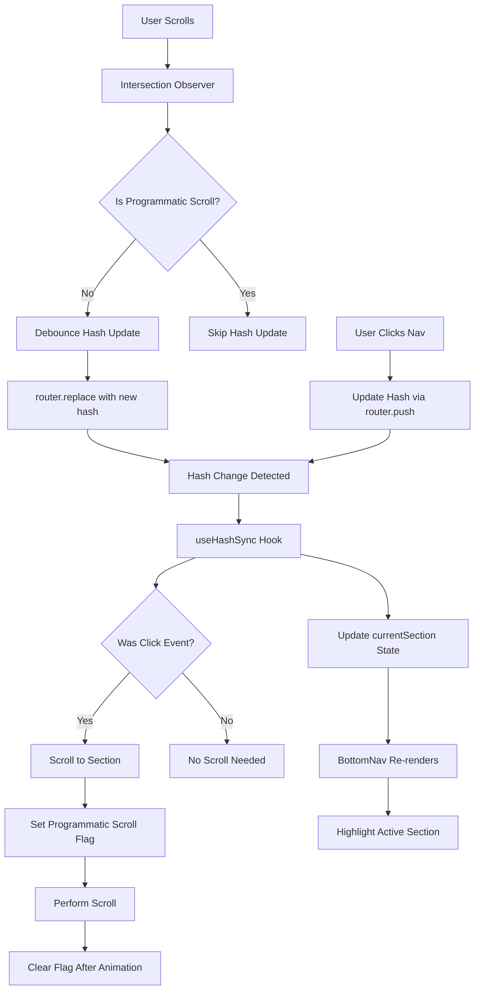

# Design Document: Navigation Hash Synchronization

## Overview

This design addresses the synchronization issue between scroll position and URL hash in the single-page application's navigation system. Currently, the system maintains two separate sources of truth: React state (`currentSection`) and the URL hash. This creates inconsistencies where manual scrolling updates state but not the hash, while clicking navigation updates both.

The solution implements a **single source of truth pattern** where the URL hash becomes the authoritative state, and React state is derived from it. This approach mirrors the carousel example provided, where `useSearchParams` maintains state in the URL. Here, we use the hash fragment as our state container.

### Key Design Principles

1. **Hash as Single Source of Truth**: The URL hash is the authoritative state; React state syncs from it
2. **Bidirectional Synchronization**: Both scroll and click events update the hash, which triggers React updates
3. **Debouncing**: Hash updates during scroll are debounced to prevent performance issues
4. **Loop Prevention**: Programmatic scrolls temporarily disable hash updates to prevent infinite loops
5. **Browser History Management**: Use `router.replace()` for scroll-triggered updates, `router.push()` for click-triggered updates

## Architecture

### Current Architecture (Problem)

```
User Scroll → Intersection Observer → Update React State (currentSection)
                                       ❌ Hash NOT updated

User Click → navigateToSection() → Update Hash + Scroll + Update React State
                                    ✅ Both updated
```

**Problem**: Two separate code paths with different behaviors create inconsistency.

### New Architecture (Solution)

```
User Scroll → Intersection Observer → Debounced Hash Update (replace)
                                       ↓
                                    Hash Change Event
                                       ↓
                                    Update React State

User Click → Update Hash (push) → Hash Change Event → Update React State + Scroll
                                                        ↓
                                                     (Loop Prevention Active)
```

**Solution**: Single code path where hash changes always trigger state updates.

### Component Interaction Diagram



## Components and Interfaces

### Critical UX Consideration: Seamless Hash Updates

**The Problem**: When the hash updates during manual scrolling, we must NOT trigger a scroll operation, or the page will jump.

**The Solution**: Before scrolling in response to a hash change, check if the target section is already visible. If it is, skip the scroll.

**Flow Diagram**:
```
User Scrolls Manually
  ↓
Intersection Observer detects section "music" is visible
  ↓
Update hash to #music (via router.replace)
  ↓
Hash change event fires
  ↓
useHashSync detects hash change
  ↓
Check: Is "music" section already visible? → YES
  ↓
Update state only, DO NOT SCROLL ✓ (seamless)
  ↓
Navigation highlighting updates (no page jump)

---

User Clicks "music" navigation item
  ↓
Update hash to #music (via router.push)
  ↓
Hash change event fires
  ↓
useHashSync detects hash change
  ↓
Check: Is "music" section already visible? → NO
  ↓
Update state AND scroll to section ✓ (smooth navigation)
  ↓
Set programmatic scroll flag (prevent loop)
```

This ensures hash updates during scroll are completely seamless with no page jumps.

### 1. useHashSync Hook (New)

**Purpose**: Central hook that listens to hash changes and synchronizes React state.

**Location**: `src/hooks/useHashSync.ts`

**Interface**:
```typescript
interface UseHashSyncOptions {
  sections: SectionId[];
  onHashChange?: (section: SectionId) => void;
}

interface UseHashSyncReturn {
  currentSection: SectionId | null;
  updateHash: (section: SectionId, addToHistory?: boolean) => void;
}

function useHashSync(options: UseHashSyncOptions): UseHashSyncReturn
```

**Responsibilities**:
- Listen to hash changes (via `hashchange` event and Next.js router)
- Parse hash and validate against known sections
- Update `currentSection` state when hash changes
- Provide `updateHash` function for programmatic hash updates
- Handle initial page load with hash
- Trigger scroll ONLY when target section is not already visible (prevents page jumps during scroll-triggered hash updates)

**Implementation Details**:
- Use `useRouter()` from Next.js for hash manipulation
- Use `useEffect` with `hashchange` event listener as fallback
- Debounce hash updates (150ms) when called from scroll observer
- Check if target section is visible before scrolling (prevents jumps during scroll-triggered hash updates)
- Use Intersection Observer ratio to determine visibility (threshold > 0.3 = visible)
- Use `router.replace()` for scroll-triggered updates (no history entry)
- Use `router.push()` for click-triggered updates (create history entry)

### 2. useScrollObserver Hook (Modified)

**Purpose**: Detect visible sections and trigger hash updates (replaces `useNavigationObserver`).

**Location**: `src/hooks/useScrollObserver.ts`

**Interface**:
```typescript
interface UseScrollObserverOptions {
  updateHash: (section: SectionId, addToHistory?: boolean) => void;
  isProgrammaticScroll: () => boolean;
  threshold?: number;
  rootMargin?: string;
}

function useScrollObserver(
  refs: Map<SectionId, React.RefObject<HTMLElement | null>>,
  options: UseScrollObserverOptions
): void
```

**Responsibilities**:
- Use Intersection Observer to detect visible sections
- Call `updateHash(section, false)` when active section changes
- Check `isProgrammaticScroll()` before updating hash
- Debounce hash updates (150ms) to prevent excessive calls
- Reuse existing `useIntersectionObserver` logic

**Implementation Details**:
- Wrap existing `useIntersectionObserver` hook
- Add programmatic scroll check before calling `updateHash`
- Pass `addToHistory: false` to use `router.replace()`

### 3. NavigationContext (Modified)

**Purpose**: Provide navigation state and actions to components.

**Location**: `src/contexts/NavigationContext.tsx`

**Interface Changes**:
```typescript
interface NavigationContextValue {
  // State (derived from hash)
  currentSection: SectionId | null;
  previousSection: SectionId | null;
  nextSection: SectionId | null;
  
  // Section management (unchanged)
  sections: SectionId[];
  registerSection: (id: SectionId, ref: React.RefObject<HTMLElement | null>, order: number) => void;
  unregisterSection: (id: SectionId) => void;
  
  // Navigation actions (modified)
  navigateToSection: (id: SectionId) => void; // Now updates hash only
  navigateNext: () => void;
  navigatePrevious: () => void;
  
  // Section refs (unchanged)
  getSectionRefs: () => Map<SectionId, React.RefObject<HTMLElement | null>>;
  
  // New: Hash synchronization
  updateHash: (section: SectionId, addToHistory?: boolean) => void;
  isProgrammaticScroll: () => boolean;
}
```

**Responsibilities**:
- Use `useHashSync` hook to manage `currentSection` state
- Provide `updateHash` function from `useHashSync`
- Provide `isProgrammaticScroll` flag for loop prevention
- Modify `navigateToSection` to only update hash (scroll handled by `useHashSync`)
- Remove internal `_setCurrentSection` (no longer needed)

**Implementation Details**:
- Replace `useState(currentSection)` with `useHashSync` hook
- Use `useRef` for programmatic scroll flag
- Set flag before scrolling, clear after animation completes
- `navigateToSection` calls `updateHash(id, true)` to use `router.push()`

### 4. BottomNav Component (Minimal Changes)

**Purpose**: Display navigation items and handle click events.

**Location**: `src/components/navigation/BottomNav.tsx`

**Changes**:
- No interface changes needed
- `onNavigate` prop still receives `navigateToSection` function
- Component behavior unchanged (clicks call `navigateToSection`)

### 5. Section Visibility Checker (New Utility)

**Purpose**: Determine if a section is currently visible in the viewport to prevent unnecessary scrolling.

**Location**: `src/hooks/useHashSync.ts` (internal utility)

**Interface**:
```typescript
function isSectionVisible(
  sectionId: SectionId,
  refs: Map<SectionId, React.RefObject<HTMLElement | null>>,
  threshold: number = 0.3
): boolean
```

**Implementation**:
```typescript
function isSectionVisible(
  sectionId: SectionId,
  refs: Map<SectionId, React.RefObject<HTMLElement | null>>,
  threshold: number = 0.3
): boolean {
  const ref = refs.get(sectionId);
  if (!ref?.current) return false;
  
  const rect = ref.current.getBoundingClientRect();
  const windowHeight = window.innerHeight;
  
  // Calculate how much of the section is visible
  const visibleHeight = Math.min(rect.bottom, windowHeight) - Math.max(rect.top, 0);
  const sectionHeight = rect.height;
  const visibilityRatio = visibleHeight / sectionHeight;
  
  // Section is considered visible if threshold is met
  return visibilityRatio >= threshold;
}
```

**Responsibilities**:
- Check if a section is currently visible in viewport
- Use same threshold as Intersection Observer for consistency (0.3 = 30% visible)
- Return true if section visibility ratio >= threshold
- Used by `useHashSync` to prevent scrolling when hash updates during manual scroll

**Critical for UX**: This function ensures that when a user scrolls manually and the hash updates to reflect their position, we DON'T scroll the page (which would cause a jarring jump). The hash update is seamless because we only scroll when the target section is NOT already visible.

### 5. Programmatic Scroll Flag (New Utility)

**Purpose**: Prevent infinite loops between hash updates and scroll events.

**Implementation**:
```typescript
// In NavigationContext
const programmaticScrollRef = useRef(false);
const scrollTimeoutRef = useRef<NodeJS.Timeout | null>(null);

const setProgrammaticScroll = (value: boolean, duration: number = 800) => {
  programmaticScrollRef.current = value;
  
  if (value) {
    // Clear existing timeout
    if (scrollTimeoutRef.current) {
      clearTimeout(scrollTimeoutRef.current);
    }
    
    // Auto-clear after duration
    scrollTimeoutRef.current = setTimeout(() => {
      programmaticScrollRef.current = false;
    }, duration);
  }
};

const isProgrammaticScroll = () => programmaticScrollRef.current;
```

**Responsibilities**:
- Track whether current scroll is programmatic (triggered by hash change)
- Auto-clear flag after scroll animation completes
- Prevent scroll observer from updating hash during programmatic scroll

## Data Models

### Hash State Model

```typescript
// Hash format: #section-id or empty
type HashState = `#${SectionId}` | "";

// Parse hash from URL
function parseHash(hash: string): SectionId | null {
  const cleaned = hash.replace(/^#/, "");
  return cleaned as SectionId || null;
}

// Validate hash against known sections
function validateHash(hash: SectionId | null, sections: SectionId[]): SectionId | null {
  if (!hash) return sections[0] ?? null; // Default to first section
  return sections.includes(hash) ? hash : sections[0] ?? null;
}
```

### Update Source Tracking

```typescript
type UpdateSource = "scroll" | "click" | "history" | "initial";

interface HashUpdateEvent {
  section: SectionId;
  source: UpdateSource;
  timestamp: number;
  addToHistory: boolean;
}
```

### Debounce State

```typescript
interface DebounceState {
  timerId: NodeJS.Timeout | null;
  pendingSection: SectionId | null;
  lastUpdateTime: number;
}
```

## Correctness Properties

*A property is a characteristic or behavior that should hold true across all valid executions of a system—essentially, a formal statement about what the system should do. Properties serve as the bridge between human-readable specifications and machine-verifiable correctness guarantees.*


### Property 1: Hash-State Synchronization Invariant

*For any* point in time after initialization, the Current_Section state SHALL always match the URL_Hash (or be null if hash is empty/invalid).

**Validates: Requirements 7.2, 8.4**

This is the core invariant of the system. The hash is the single source of truth, and state must always reflect it. This property ensures that regardless of how the hash changes (scroll, click, history navigation), the React state stays synchronized.

### Property 2: Scroll-Triggered Hash Updates

*For any* section that becomes the Active_Section through user scrolling (not programmatic), the Navigation_System SHALL update the URL_Hash to match that section's identifier within 300ms.

**Validates: Requirements 1.1, 1.4**

This property ensures that manual scrolling always results in hash updates, maintaining the single source of truth. The timing constraint ensures responsiveness.

### Property 3: Router Method Selection

*For any* hash update, the Navigation_System SHALL use router.replace() when the update source is scroll or history navigation, and router.push() when the update source is a user click.

**Validates: Requirements 1.2, 2.2**

This property ensures correct browser history management. Scroll-triggered updates shouldn't create history entries (use replace), while click-triggered updates should (use push).

### Property 4: Debounced Hash Updates

*For any* sequence of rapid section changes (within 150ms intervals), the Navigation_System SHALL debounce hash updates such that only the most recent section change is applied after the debounce period expires.

**Validates: Requirements 1.3, 5.4, 8.1, 8.2**

This property ensures performance during rapid scrolling by batching hash updates. The final hash must match the final visible section.

### Property 5: Click Navigation Completeness

*For any* navigation item click, the Navigation_System SHALL both scroll to the target section and update the URL_Hash, completing both operations within 500ms.

**Validates: Requirements 2.1, 2.3**

This property ensures that click navigation is complete and responsive, updating both visual position and URL state.

### Property 6: Idempotent Active Navigation

*For any* navigation item that is currently active, clicking it SHALL not trigger state changes, router calls, or scroll operations.

**Validates: Requirements 2.4**

This property ensures efficiency by preventing unnecessary operations when clicking the already-active section.

### Property 7: Browser History Navigation

*For any* browser history navigation event (back or forward), the Navigation_System SHALL scroll to the section indicated by the resulting URL_Hash, update the Current_Section state to match, and SHALL NOT create additional history entries.

**Validates: Requirements 3.1, 3.2, 3.3, 3.4**

This property ensures proper integration with browser history, allowing users to navigate through their browsing history correctly.

### Property 8: Initial Page Load with Hash

*For any* page load with a valid URL_Hash, the Navigation_System SHALL set the Current_Section state to match the hash and scroll to the corresponding section after rendering, without creating additional history entries.

**Validates: Requirements 4.1, 4.3, 4.4**

This property ensures that deep links work correctly, allowing users to share URLs that navigate directly to specific sections.

### Property 9: Invalid Hash Handling

*For any* page load with an invalid or empty URL_Hash, the Navigation_System SHALL default to the first section and update the URL_Hash accordingly using router.replace().

**Validates: Requirements 4.2**

This property ensures graceful error handling when users navigate to invalid hashes.

### Property 10: Programmatic Scroll Loop Prevention

*For any* programmatic scroll operation (triggered by hash change), the Navigation_System SHALL disable scroll-triggered hash updates during the scroll animation and re-enable them within 100ms after completion.

**Validates: Requirements 5.1, 5.2, 5.3**

This property prevents infinite loops where hash changes trigger scrolls, which trigger hash updates, which trigger more scrolls. The programmatic scroll flag breaks this cycle.

### Property 11: Reduced Motion Accessibility

*For any* navigation operation when the user has reduced motion preferences enabled, the Navigation_System SHALL use instant scrolling (behavior: "auto") instead of smooth scrolling (behavior: "smooth").

**Validates: Requirements 6.1**

This property ensures accessibility for users with motion sensitivity by respecting their system preferences.

### Property 12: Smooth Scroll Timing

*For any* navigation operation when smooth scrolling is enabled, the scroll animation SHALL complete within 800ms.

**Validates: Requirements 6.2**

This property ensures that smooth scroll animations are responsive and don't feel sluggish.

### Property 13: Focus Management

*For any* navigation operation, the Navigation_System SHALL set keyboard focus to the target section element and update ARIA attributes to reflect the current navigation state.

**Validates: Requirements 6.3, 6.4**

This property ensures keyboard accessibility and proper screen reader announcements during navigation.

### Property 14: Visual Highlighting Synchronization

*For any* Current_Section state update, the Navigation_System SHALL update the visual highlighting of navigation items within 50ms to match the active section.

**Validates: Requirements 7.1, 7.4**

This property ensures that visual feedback is immediate and always matches the current section, preventing user confusion.

### Property 15: Concurrent Event Prioritization

*For any* situation where scroll and click events occur simultaneously (within 50ms), the Navigation_System SHALL prioritize the most recent user action and apply only that navigation change.

**Validates: Requirements 7.3**

This property ensures that when multiple navigation events occur rapidly, the user's most recent intent is respected.

### Property 16: Intersection Observer Batching

*For any* sequence of rapid Intersection Observer callbacks (within 100ms), the Navigation_System SHALL batch state updates to minimize React re-renders.

**Validates: Requirements 8.3**

This property ensures React performance by preventing excessive re-renders during rapid scrolling.

## Error Handling

### Invalid Hash Values

**Scenario**: User navigates to URL with invalid hash (e.g., `/#invalid-section`)

**Handling**:
1. `validateHash()` function checks hash against known sections
2. If invalid, default to first section in `sections` array
3. Update hash using `router.replace()` to correct the URL
4. Log warning to console for debugging

**Code**:
```typescript
function validateHash(hash: SectionId | null, sections: SectionId[]): SectionId | null {
  if (!hash) return sections[0] ?? null;
  
  if (!sections.includes(hash)) {
    console.warn(`Invalid hash "${hash}", defaulting to first section`);
    return sections[0] ?? null;
  }
  
  return hash;
}
```

### Missing Section References

**Scenario**: Hash points to valid section ID, but section element not yet registered

**Handling**:
1. Check if section ref exists before scrolling
2. If missing, set state but skip scroll operation
3. Retry scroll after 100ms (section may still be mounting)
4. After 3 retries, log error and give up

**Code**:
```typescript
function scrollToSection(sectionId: SectionId, retries = 0) {
  const registration = sectionsMapRef.current.get(sectionId);
  
  if (!registration?.ref.current) {
    if (retries < 3) {
      setTimeout(() => scrollToSection(sectionId, retries + 1), 100);
    } else {
      console.error(`Section "${sectionId}" not found after ${retries} retries`);
    }
    return;
  }
  
  // Perform scroll...
}
```

### Browser History Manipulation Failures

**Scenario**: `router.push()` or `router.replace()` fails (rare, but possible)

**Handling**:
1. Wrap router calls in try-catch
2. Fall back to direct `window.location.hash` manipulation
3. Log error for monitoring
4. Continue with state update even if hash update fails

**Code**:
```typescript
function updateHash(section: SectionId, addToHistory: boolean) {
  try {
    if (addToHistory) {
      router.push(`#${section}`);
    } else {
      router.replace(`#${section}`);
    }
  } catch (error) {
    console.error('Router hash update failed, using fallback', error);
    window.location.hash = section;
  }
}
```

### Intersection Observer Not Supported

**Scenario**: Browser doesn't support Intersection Observer API

**Handling**:
1. Check for `IntersectionObserver` in window during initialization
2. If not supported, fall back to scroll event listener
3. Use `getBoundingClientRect()` to detect visible section
4. Throttle scroll events to prevent performance issues

**Code**:
```typescript
if (!('IntersectionObserver' in window)) {
  // Fallback: use scroll event with throttling
  const handleScroll = throttle(() => {
    const visibleSection = findVisibleSection();
    if (visibleSection) {
      updateHash(visibleSection, false);
    }
  }, 150);
  
  window.addEventListener('scroll', handleScroll);
  return () => window.removeEventListener('scroll', handleScroll);
}
```

### Race Conditions During Rapid Navigation

**Scenario**: User rapidly clicks multiple navigation items or scrolls while clicking

**Handling**:
1. Use timestamp tracking to identify most recent action
2. Cancel pending debounced updates when new action occurs
3. Programmatic scroll flag prevents scroll observer interference
4. Final state always reflects most recent user action

**Code**:
```typescript
const lastActionRef = useRef({ timestamp: 0, section: null });

function handleNavigation(section: SectionId, source: UpdateSource) {
  const now = Date.now();
  
  // Cancel pending debounced updates
  if (debounceTimerRef.current) {
    clearTimeout(debounceTimerRef.current);
  }
  
  // Update last action
  lastActionRef.current = { timestamp: now, section };
  
  // Process navigation...
}
```

## Testing Strategy

### Dual Testing Approach

This feature requires both unit tests and property-based tests for comprehensive coverage:

**Unit Tests**: Focus on specific examples, edge cases, and integration points
- Initial page load with specific hashes
- Browser back/forward button clicks
- Invalid hash handling
- Component integration (NavigationContext + BottomNav)
- Error conditions (missing refs, unsupported browser features)

**Property-Based Tests**: Verify universal properties across all inputs
- Hash-state synchronization across random section sequences
- Debouncing behavior with random timing patterns
- Router method selection across random navigation patterns
- Loop prevention with random scroll/click combinations
- All 16 correctness properties defined above

### Property-Based Testing Configuration

**Library**: fast-check (already in project dependencies)

**Configuration**:
- Minimum 100 iterations per property test
- Each test tagged with feature name and property number
- Tag format: `Feature: navigation-hash-sync, Property N: [property title]`

**Example Test Structure**:
```typescript
import fc from 'fast-check';

describe('Feature: navigation-hash-sync', () => {
  it('Property 1: Hash-State Synchronization Invariant', () => {
    fc.assert(
      fc.property(
        fc.array(fc.constantFrom('home', 'music', 'shows', 'about')),
        (sectionSequence) => {
          // Test that state always matches hash after each section change
          // ... test implementation
        }
      ),
      { numRuns: 100 }
    );
  });
  
  it('Property 4: Debounced Hash Updates', () => {
    fc.assert(
      fc.property(
        fc.array(fc.record({
          section: fc.constantFrom('home', 'music', 'shows', 'about'),
          delay: fc.integer({ min: 0, max: 200 })
        })),
        (rapidChanges) => {
          // Test that only final section is applied after debounce
          // ... test implementation
        }
      ),
      { numRuns: 100 }
    );
  });
});
```

### Unit Test Coverage

**Critical Paths**:
1. Initial page load with hash → scroll to section
2. Click navigation → update hash → scroll to section
3. Manual scroll → detect section → update hash
4. Browser back → read hash → scroll to section
5. Invalid hash → default to first section

**Edge Cases**:
1. Empty hash on load
2. Hash pointing to non-existent section
3. Rapid clicking same navigation item
4. Scrolling during programmatic scroll
5. Reduced motion preference enabled
6. Section not yet mounted when hash changes

**Integration Tests**:
1. NavigationContext + useHashSync integration
2. NavigationContext + useScrollObserver integration
3. BottomNav + NavigationContext integration
4. Full navigation flow (click → scroll → hash → state)

### Testing Tools

- **Jest**: Unit test runner
- **@testing-library/react**: Component testing
- **@testing-library/user-event**: User interaction simulation
- **fast-check**: Property-based testing
- **jest.spyOn**: Mock router methods for verification
- **jest.useFakeTimers**: Test debouncing and timing constraints

### Test Execution

Run tests with:
```bash
pnpm test                    # Run all unit tests
pnpm test:watch              # Watch mode for development
pnpm test -- navigation-hash # Run only navigation hash tests
```

### Performance Testing

While not part of automated tests, manual performance testing should verify:
- No jank during rapid scrolling
- Smooth animations on low-end devices
- No memory leaks during extended navigation
- Acceptable bundle size impact (<5KB gzipped)

## Implementation Notes

### Migration Strategy

1. **Phase 1**: Implement new hooks (`useHashSync`, `useScrollObserver`) without removing old code
2. **Phase 2**: Update `NavigationContext` to use new hooks, keep old code as fallback
3. **Phase 3**: Test thoroughly in development
4. **Phase 4**: Remove old code (`useNavigationObserver`, direct state management)
5. **Phase 5**: Deploy to production

### Backward Compatibility

- Existing navigation behavior preserved (smooth scroll, reduced motion support)
- No breaking changes to component APIs
- URL structure unchanged (still uses hash fragments)
- Existing shared links continue to work

### Performance Considerations

- Debouncing reduces hash updates from ~60/second (during scroll) to ~6/second
- Batched React updates prevent excessive re-renders
- Programmatic scroll flag eliminates infinite loops
- Minimal bundle size impact (new code ~2KB gzipped)

### Browser Compatibility

- Intersection Observer: Supported in all modern browsers (Chrome 51+, Firefox 55+, Safari 12.1+)
- Fallback provided for older browsers using scroll events
- Next.js router: Works in all browsers supported by Next.js 16
- Hash navigation: Universal browser support

### Accessibility Considerations

- Reduced motion preferences respected
- Keyboard focus management maintained
- ARIA attributes updated for screen readers
- Hash changes announced by screen readers (browser native behavior)
- No JavaScript required for basic hash navigation (progressive enhancement)
