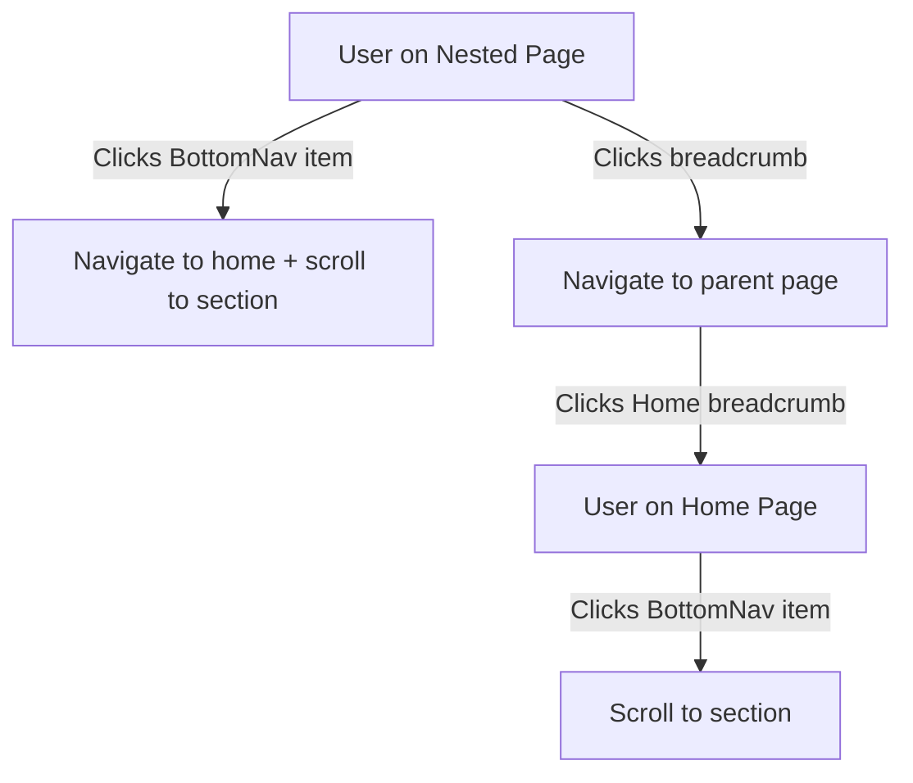

# Design Document: Persistent Navigation and Breadcrumbs

## Overview

This design implements persistent navigation and breadcrumb functionality for The Custard Screams band website. The solution addresses the current limitation where nested pages lack navigation elements by:

1. **Moving BottomNav to the root layout** - Making it available on all pages, not just the home page
2. **Creating a Breadcrumb component** - Providing hierarchical navigation on nested pages
3. **Implementing smart navigation behavior** - Handling section scrolling on the home page and page navigation on nested pages
4. **Maintaining consistent styling** - Using the same padding, margins, and punk rock aesthetic across all pages

The design leverages Next.js 16 App Router patterns, the existing NavigationContext, and TypeScript for type safety.

## Architecture

### Component Hierarchy

```
RootLayout (src/app/layout.tsx)
├── NavigationProvider (existing)
├── {children} (page content)
├── BottomNav (moved from page.tsx)
└── CookieConsent (existing)
```

### Page Structure

**Home Page (/):**
```
NavigationProvider
├── HeroSection
├── MusicSection
├── ShowsSection
├── AboutSection
├── Footer
└── BottomNav (fixed at bottom)
```

**Nested Pages (e.g., /music/the-custard-screams-ep/royal-flush):**
```
NavigationProvider
├── Breadcrumb (at top)
├── Page Content
└── BottomNav (fixed at bottom)
```

### Navigation Flow



## Components and Interfaces

### 1. Breadcrumb Component

**Location:** `src/components/navigation/Breadcrumb.tsx`

**Purpose:** Display hierarchical navigation trail on nested pages

**Interface:**
```typescript
interface BreadcrumbItem {
  label: string;
  href: string;
  isActive: boolean;
}

interface BreadcrumbProps {
  className?: string;
}

export default function Breadcrumb({ className }: BreadcrumbProps): JSX.Element
```

**Behavior:**
- Automatically generates breadcrumb trail from current URL pathname
- Parses URL segments and converts them to human-readable labels
- Renders as an ordered list with semantic HTML
- First item is always "Home" linking to "/"
- Last item is the current page (non-clickable)
- Intermediate items link to their respective parent pages

**URL Parsing Logic:**
```typescript
function generateBreadcrumbs(pathname: string): BreadcrumbItem[] {
  // Split pathname into segments
  const segments = pathname.split('/').filter(Boolean);
  
  // Always start with Home
  const breadcrumbs: BreadcrumbItem[] = [
    { label: 'Home', href: '/', isActive: false }
  ];
  
  // Build breadcrumbs for each segment
  let currentPath = '';
  segments.forEach((segment, index) => {
    currentPath += `/${segment}`;
    const isLast = index === segments.length - 1;
    
    breadcrumbs.push({
      label: formatSegmentLabel(segment),
      href: currentPath,
      isActive: isLast
    });
  });
  
  return breadcrumbs;
}

function formatSegmentLabel(segment: string): string {
  // Convert kebab-case to Title Case
  // Handle special cases: "ep" -> "EP"
  const specialCases: Record<string, string> = {
    'ep': 'EP',
    'the-custard-screams-ep': 'The Custard Screams EP'
  };
  
  if (specialCases[segment]) {
    return specialCases[segment];
  }
  
  return segment
    .split('-')
    .map(word => word.charAt(0).toUpperCase() + word.slice(1))
    .join(' ');
}
```

**Styling:**
- Uses Tailwind CSS classes
- Amber color (#fbbf24) for clickable links
- Muted gray for active (current) item
- Hover effects with smooth transitions (300ms)
- Responsive font sizing
- Adequate touch targets (44x44px minimum)

### 2. Enhanced BottomNav Component

**Location:** `src/components/navigation/BottomNav.tsx` (existing, needs enhancement)

**Current State:** Only handles section scrolling on home page

**Required Changes:**
1. Detect current route (home vs nested page)
2. On home page: scroll to section (existing behavior)
3. On nested page: navigate to home page with section anchor

**Enhanced Interface:**
```typescript
interface BottomNavProps {
  activeSection: SectionId | null;
  onNavigate: (sectionId: SectionId) => void;
}

// Internal hook to detect route
function useIsHomePage(): boolean {
  const pathname = usePathname();
  return pathname === '/';
}
```

**Enhanced Behavior:**
```typescript
function BottomNav({ activeSection, onNavigate }: BottomNavProps) {
  const isHomePage = useIsHomePage();
  const router = useRouter();
  
  const handleNavigate = (sectionId: SectionId) => {
    if (isHomePage) {
      // Existing behavior: scroll to section
      onNavigate(sectionId);
    } else {
      // New behavior: navigate to home with anchor
      router.push(`/#${sectionId}`);
    }
  };
  
  // ... rest of component
}
```

### 3. Layout Integration

**Location:** `src/app/layout.tsx` (existing, needs modification)

**Current State:** 
- Wraps children with NavigationProvider
- Renders CookieConsent banner
- Does NOT render BottomNav

**Required Changes:**
1. Import BottomNav component
2. Import useNavigation hook
3. Convert to client component (already is)
4. Render BottomNav after children

**Challenge:** RootLayout cannot use hooks directly because it's a layout component

**Solution:** Create a LayoutClient component that handles navigation state

**New Component:** `src/app/LayoutClient.tsx`

```typescript
"use client";

interface LayoutClientProps {
  children: React.ReactNode;
}

export default function LayoutClient({ children }: LayoutClientProps) {
  const { currentSection, navigateToSection } = useNavigation();
  
  return (
    <>
      {children}
      <BottomNav 
        activeSection={currentSection} 
        onNavigate={navigateToSection} 
      />
    </>
  );
}
```

**Updated RootLayout:**
```typescript
export default function RootLayout({ children }: { children: React.ReactNode }) {
  const { hasConsent, acceptCookies, declineCookies } = useCookieConsent();

  return (
    <html lang="en-GB" className={`${geist.variable}`}>
      <head>{/* ... existing head content ... */}</head>
      <body className="bg-black text-white">
        <NavigationProvider>
          <LayoutClient>
            {children}
          </LayoutClient>
          
          {hasConsent === null && (
            <CookieConsent onAccept={acceptCookies} onDecline={declineCookies} />
          )}
        </NavigationProvider>
      </body>
    </html>
  );
}
```

### 4. Home Page Updates

**Location:** `src/app/page.tsx` (existing, needs modification)

**Required Changes:**
1. Remove BottomNav import and rendering (now in layout)
2. Keep all existing section rendering
3. Keep existing navigation observer setup

**Simplified HomePage:**
```typescript
export default function HomePage() {
  const { navigateToSection } = useNavigation();

  // Set up intersection observer to track active section
  useNavigationObserver({
    threshold: 0.3,
    rootMargin: "-80px 0px -80px 0px",
  });

  // Handle initial hash navigation
  useEffect(() => {
    if (typeof window !== "undefined" && window.location.hash) {
      const hash = window.location.hash.slice(1);
      if (hash) {
        setTimeout(() => {
          navigateToSection(hash as any);
        }, 100);
      }
    }
  }, [navigateToSection]);

  return (
    <>
      {/* Structured Data */}
      {/* ... existing structured data ... */}

      {/* Main content */}
      <HeroSection />
      <MusicSection />
      <ShowsSection />
      <AboutSection />
      
      {/* Footer */}
      <div className="pb-20">
        <Footer />
      </div>
      
      {/* BottomNav now rendered in layout */}
    </>
  );
}
```

### 5. Nested Page Template

**Location:** Create new shared layout for nested pages

**Option A:** Use Next.js nested layouts (recommended)

Create `src/app/music/layout.tsx`:
```typescript
import Breadcrumb from "~/components/navigation/Breadcrumb";

export default function MusicLayout({ children }: { children: React.ReactNode }) {
  return (
    <div className="min-h-screen pb-20">
      <Breadcrumb className="p-4" />
      <main className="p-4 md:p-6">
        {children}
      </main>
    </div>
  );
}
```

**Option B:** Wrap individual pages (less recommended, more duplication)

Each nested page would import and use Breadcrumb:
```typescript
export default function SongPage() {
  return (
    <div className="min-h-screen pb-20">
      <Breadcrumb className="p-4" />
      <article className="p-4 md:p-6">
        {/* page content */}
      </article>
    </div>
  );
}
```

**Recommendation:** Use Option A (nested layouts) for better code reuse and consistency

## Data Models

### BreadcrumbItem Type

```typescript
/**
 * Represents a single item in the breadcrumb trail
 */
interface BreadcrumbItem {
  /** Display text for the breadcrumb */
  label: string;
  
  /** URL path for navigation */
  href: string;
  
  /** Whether this is the current page (non-clickable) */
  isActive: boolean;
}
```

### Enhanced Type Definitions

**Location:** `src/lib/types.ts` (add to existing file)

```typescript
/**
 * Props for Breadcrumb component
 */
export interface BreadcrumbProps {
  className?: string;
}

/**
 * Represents a single breadcrumb item in the navigation trail
 */
export interface BreadcrumbItem {
  label: string;
  href: string;
  isActive: boolean;
}
```

### Utility Functions

**Location:** `src/lib/breadcrumbs.ts` (new file)

```typescript
/**
 * Utility functions for breadcrumb generation
 */

/**
 * Special case mappings for URL segments to display labels
 */
const SEGMENT_LABEL_MAP: Record<string, string> = {
  'ep': 'EP',
  'the-custard-screams-ep': 'The Custard Screams EP',
  'music': 'Music',
  'about': 'About',
  'live-shows': 'Live Shows',
};

/**
 * Convert a URL segment to a human-readable label
 * Handles kebab-case conversion and special cases
 */
export function formatSegmentLabel(segment: string): string {
  // Check for special cases first
  if (SEGMENT_LABEL_MAP[segment]) {
    return SEGMENT_LABEL_MAP[segment];
  }
  
  // Convert kebab-case to Title Case
  return segment
    .split('-')
    .map(word => word.charAt(0).toUpperCase() + word.slice(1))
    .join(' ');
}

/**
 * Generate breadcrumb items from a URL pathname
 * Always includes "Home" as the first item
 */
export function generateBreadcrumbs(pathname: string): BreadcrumbItem[] {
  // Remove trailing slash and split into segments
  const normalizedPath = pathname.replace(/\/$/, '');
  const segments = normalizedPath.split('/').filter(Boolean);
  
  // Start with Home
  const breadcrumbs: BreadcrumbItem[] = [
    { label: 'Home', href: '/', isActive: false }
  ];
  
  // Return early if we're on the home page
  if (segments.length === 0) {
    breadcrumbs[0].isActive = true;
    return breadcrumbs;
  }
  
  // Build breadcrumbs for each segment
  let currentPath = '';
  segments.forEach((segment, index) => {
    currentPath += `/${segment}`;
    const isLast = index === segments.length - 1;
    
    breadcrumbs.push({
      label: formatSegmentLabel(segment),
      href: currentPath,
      isActive: isLast
    });
  });
  
  return breadcrumbs;
}

/**
 * Check if breadcrumbs should be displayed for a given pathname
 * Breadcrumbs are hidden on the home page
 */
export function shouldShowBreadcrumbs(pathname: string): boolean {
  const normalizedPath = pathname.replace(/\/$/, '');
  return normalizedPath !== '' && normalizedPath !== '/';
}
```


## Correctness Properties

*A property is a characteristic or behavior that should hold true across all valid executions of a system—essentially, a formal statement about what the system should do. Properties serve as the bridge between human-readable specifications and machine-verifiable correctness guarantees.*

### Property 1: BottomNav Universal Presence

*For any* page in the application (home page or nested page), the BottomNav component should be rendered in the DOM with fixed positioning at the bottom of the viewport.

**Validates: Requirements 1.1, 1.2, 4.7**

### Property 2: BottomNav Consistent Styling

*For any* page in the application, the BottomNav component should maintain consistent visual styling including black background (bg-black), amber accents for active items, and appropriate z-index layering.

**Validates: Requirements 1.5, 4.6**

### Property 3: BottomNav Touch Target Accessibility

*For all* navigation items in the BottomNav component, the computed dimensions should be at least 44x44 pixels to meet touch target accessibility requirements.

**Validates: Requirements 1.6, 7.5**

### Property 4: Breadcrumb Conditional Display

*For any* page pathname, breadcrumbs should be displayed if and only if the pathname is not the root ("/"), ensuring breadcrumbs appear on nested pages but not on the home page.

**Validates: Requirements 2.1, 2.2**

### Property 5: Breadcrumb Trail Generation

*For any* valid URL pathname with N segments, the generateBreadcrumbs function should produce exactly N+1 breadcrumb items (including "Home"), where each item corresponds to a route segment in the path hierarchy.

**Validates: Requirements 2.4, 2.5, 8.1, 8.2**

### Property 6: Breadcrumb Trail Structure

*For any* generated breadcrumb trail:
- The first item should always have label "Home" and href "/"
- All intermediate items (if any) should be clickable with isActive=false
- The final item should have isActive=true and represent the current page
- Each intermediate item's href should be the cumulative path up to that segment

**Validates: Requirements 2.6, 2.7, 2.8, 8.5**

### Property 7: URL Slug Formatting

*For any* kebab-case URL segment (e.g., "royal-flush", "the-custard-screams-ep"), the formatSegmentLabel function should convert it to Title Case (e.g., "Royal Flush", "The Custard Screams EP"), with special handling for known abbreviations like "ep" → "EP".

**Validates: Requirements 2.10, 8.3**

### Property 8: Breadcrumb Semantic HTML

*For any* rendered Breadcrumb component, it should use semantic HTML structure with:
- A nav element with aria-label="Breadcrumb"
- An ordered list (ol) containing the breadcrumb items
- The final breadcrumb item marked with aria-current="page"

**Validates: Requirements 5.1, 5.2, 5.4**

### Property 9: Breadcrumb Visual Styling

*For any* rendered Breadcrumb component:
- Clickable breadcrumbs should use amber color (#fbbf24 or text-amber-400)
- The active (final) breadcrumb should use a muted color
- Visual separators should appear between breadcrumb items
- Hover transitions should be applied to clickable items

**Validates: Requirements 2.9, 3.1, 3.2, 3.7**

### Property 10: Breadcrumb Touch Targets

*For all* clickable breadcrumb items on mobile viewports, the computed dimensions should be at least 44x44 pixels to meet touch target accessibility requirements.

**Validates: Requirements 5.6**

### Property 11: Navigation URL Hash Preservation

*For any* section navigation from a nested page to the home page, the resulting URL should include the section hash (e.g., "/#music", "/#shows") to enable proper section scrolling.

**Validates: Requirements 6.3**

### Property 12: Page Wrapper Consistent Padding

*For any* page using the layout system, the content should have consistent padding and bottom spacing (pb-20 or equivalent) to prevent content from being obscured by the fixed BottomNav.

**Validates: Requirements 4.3, 4.4**

### Property 13: Responsive Breadcrumb Layout

*For any* viewport width, the Breadcrumb component should adapt its layout appropriately, with responsive font sizing and proper handling of long breadcrumb trails through truncation or wrapping.

**Validates: Requirements 7.1, 7.2, 7.6**

### Property 14: Navigation Context Preservation

*For any* page in the application, the NavigationProvider context should remain available and functional, allowing access to currentSection, navigateToSection, and other navigation methods.

**Validates: Requirements 9.2**

### Property 15: Error Resilience for Malformed URLs

*For any* malformed or invalid URL pathname, the breadcrumb generation should fail gracefully by returning a minimal breadcrumb trail containing only the "Home" link, without throwing errors or crashing the application.

**Validates: Requirements 12.1, 12.3**

## Error Handling

### URL Parsing Errors

**Strategy:** Defensive programming with fallbacks

```typescript
export function generateBreadcrumbs(pathname: string): BreadcrumbItem[] {
  try {
    // Validate input
    if (!pathname || typeof pathname !== 'string') {
      console.warn('Invalid pathname provided to generateBreadcrumbs:', pathname);
      return [{ label: 'Home', href: '/', isActive: true }];
    }
    
    // Normal breadcrumb generation logic
    const normalizedPath = pathname.replace(/\/$/, '');
    const segments = normalizedPath.split('/').filter(Boolean);
    
    // ... rest of generation logic
    
  } catch (error) {
    console.error('Error generating breadcrumbs:', error);
    // Return minimal safe breadcrumb
    return [{ label: 'Home', href: '/', isActive: true }];
  }
}
```

### Navigation Failures

**Strategy:** Graceful degradation

```typescript
const handleNavigate = (sectionId: SectionId) => {
  try {
    if (isHomePage) {
      onNavigate(sectionId);
    } else {
      router.push(`/#${sectionId}`);
    }
  } catch (error) {
    console.error('Navigation error:', error);
    // Fallback: navigate to home without section
    router.push('/');
  }
};
```

### Component Rendering Errors

**Strategy:** Error boundaries (existing Next.js error handling)

- Next.js App Router provides built-in error boundaries
- Component-level try-catch for critical operations
- Graceful fallbacks for missing data

### Missing Parent Pages

**Strategy:** Optimistic navigation

- Breadcrumbs generate links even if parent pages don't exist
- Next.js will handle 404s naturally if user clicks non-existent parent
- No need to validate page existence during breadcrumb generation

## Testing Strategy

### Dual Testing Approach

This feature requires both unit tests and property-based tests for comprehensive coverage:

**Unit Tests:** Focus on specific examples, edge cases, and integration points
**Property Tests:** Verify universal properties across all inputs using randomized testing

### Unit Testing

**Test Files:**
- `src/components/navigation/Breadcrumb.test.tsx` - Component rendering and interaction
- `src/lib/breadcrumbs.test.ts` - Utility function behavior
- `src/app/LayoutClient.test.tsx` - Layout integration

**Key Test Cases:**

1. **Breadcrumb Component:**
   - Renders correctly on nested pages
   - Does not render on home page
   - Displays correct number of items for various URLs
   - First item is always "Home"
   - Last item is not clickable
   - Intermediate items are clickable
   - Handles click events correctly
   - Applies correct ARIA attributes

2. **URL Parsing:**
   - Handles single-segment paths
   - Handles multi-segment paths
   - Handles trailing slashes
   - Handles empty paths
   - Handles special characters
   - Handles malformed URLs

3. **Label Formatting:**
   - Converts kebab-case to Title Case
   - Handles special cases (ep → EP)
   - Handles single words
   - Handles multiple hyphens

4. **Navigation Behavior:**
   - BottomNav scrolls on home page
   - BottomNav navigates on nested pages
   - URL hash is preserved
   - Breadcrumb clicks navigate correctly

5. **Layout Integration:**
   - BottomNav renders in layout
   - NavigationProvider is available
   - Cookie consent doesn't conflict
   - Existing functionality preserved

### Property-Based Testing

**Library:** fast-check (TypeScript property-based testing library)

**Configuration:** Minimum 100 iterations per property test

**Property Test Files:**
- `src/lib/breadcrumbs.property.test.ts` - Breadcrumb generation properties

**Property Tests:**

1. **Property Test: Breadcrumb Count Invariant**
   ```typescript
   // Feature: persistent-navigation-breadcrumbs, Property 5: Breadcrumb Trail Generation
   test('breadcrumb count equals segment count plus one', () => {
     fc.assert(
       fc.property(
         fc.array(fc.stringOf(fc.char().filter(c => c !== '/')), { minLength: 1, maxLength: 5 }),
         (segments) => {
           const pathname = '/' + segments.join('/');
           const breadcrumbs = generateBreadcrumbs(pathname);
           return breadcrumbs.length === segments.length + 1;
         }
       ),
       { numRuns: 100 }
     );
   });
   ```

2. **Property Test: First Breadcrumb Always Home**
   ```typescript
   // Feature: persistent-navigation-breadcrumbs, Property 6: Breadcrumb Trail Structure
   test('first breadcrumb is always Home', () => {
     fc.assert(
       fc.property(
         fc.webPath(),
         (pathname) => {
           const breadcrumbs = generateBreadcrumbs(pathname);
           return breadcrumbs[0].label === 'Home' && breadcrumbs[0].href === '/';
         }
       ),
       { numRuns: 100 }
     );
   });
   ```

3. **Property Test: Last Breadcrumb Always Active**
   ```typescript
   // Feature: persistent-navigation-breadcrumbs, Property 6: Breadcrumb Trail Structure
   test('last breadcrumb is always active', () => {
     fc.assert(
       fc.property(
         fc.webPath().filter(p => p !== '/'),
         (pathname) => {
           const breadcrumbs = generateBreadcrumbs(pathname);
           const lastBreadcrumb = breadcrumbs[breadcrumbs.length - 1];
           return lastBreadcrumb.isActive === true;
         }
       ),
       { numRuns: 100 }
     );
   });
   ```

4. **Property Test: Intermediate Breadcrumbs Not Active**
   ```typescript
   // Feature: persistent-navigation-breadcrumbs, Property 6: Breadcrumb Trail Structure
   test('intermediate breadcrumbs are not active', () => {
     fc.assert(
       fc.property(
         fc.array(fc.stringOf(fc.char().filter(c => c !== '/')), { minLength: 2, maxLength: 5 }),
         (segments) => {
           const pathname = '/' + segments.join('/');
           const breadcrumbs = generateBreadcrumbs(pathname);
           // Check all breadcrumbs except the last
           const intermediates = breadcrumbs.slice(0, -1);
           return intermediates.every(b => b.isActive === false);
         }
       ),
       { numRuns: 100 }
     );
   });
   ```

5. **Property Test: Kebab Case Formatting**
   ```typescript
   // Feature: persistent-navigation-breadcrumbs, Property 7: URL Slug Formatting
   test('kebab-case converts to Title Case', () => {
     fc.assert(
       fc.property(
         fc.array(fc.stringOf(fc.char().filter(c => /[a-z]/.test(c)), { minLength: 1, maxLength: 10 }), { minLength: 1, maxLength: 3 }),
         (words) => {
           const kebabCase = words.join('-');
           const formatted = formatSegmentLabel(kebabCase);
           // Each word should start with uppercase
           const formattedWords = formatted.split(' ');
           return formattedWords.every(word => /^[A-Z]/.test(word));
         }
       ),
       { numRuns: 100 }
     );
   });
   ```

6. **Property Test: Error Resilience**
   ```typescript
   // Feature: persistent-navigation-breadcrumbs, Property 15: Error Resilience for Malformed URLs
   test('malformed URLs return safe fallback', () => {
     fc.assert(
       fc.property(
         fc.oneof(
           fc.constant(null),
           fc.constant(undefined),
           fc.constant(''),
           fc.constant('///'),
           fc.integer(),
           fc.object()
         ),
         (invalidInput) => {
           const breadcrumbs = generateBreadcrumbs(invalidInput as any);
           // Should return at least Home breadcrumb
           return breadcrumbs.length >= 1 && breadcrumbs[0].label === 'Home';
         }
       ),
       { numRuns: 100 }
     );
   });
   ```

7. **Property Test: Path Reconstruction**
   ```typescript
   // Feature: persistent-navigation-breadcrumbs, Property 6: Breadcrumb Trail Structure
   test('intermediate breadcrumb hrefs reconstruct path correctly', () => {
     fc.assert(
       fc.property(
         fc.array(fc.stringOf(fc.char().filter(c => c !== '/')), { minLength: 2, maxLength: 5 }),
         (segments) => {
           const pathname = '/' + segments.join('/');
           const breadcrumbs = generateBreadcrumbs(pathname);
           
           // Check each intermediate breadcrumb's href
           for (let i = 1; i < breadcrumbs.length - 1; i++) {
             const expectedHref = '/' + segments.slice(0, i).join('/');
             if (breadcrumbs[i].href !== expectedHref) {
               return false;
             }
           }
           return true;
         }
       ),
       { numRuns: 100 }
     );
   });
   ```

### Integration Testing

**Focus Areas:**
- BottomNav behavior on home vs nested pages
- Breadcrumb navigation flow
- Layout rendering with all components
- NavigationContext availability across pages

**Test Approach:**
- Use React Testing Library for component integration
- Mock Next.js router for navigation testing
- Test user interactions (clicks, keyboard navigation)
- Verify DOM structure and ARIA attributes

### Testing Workflow

**After Each Task:**
1. Run TypeScript type checking: `npm run type-check` or `tsc --noEmit`
2. Run all tests: `npm test`
3. Verify no regressions in existing functionality
4. Check test coverage for new code

**Continuous Integration:**
- All tests must pass before merging
- Type checking must pass
- No TypeScript errors allowed
- Maintain >80% code coverage for new code

