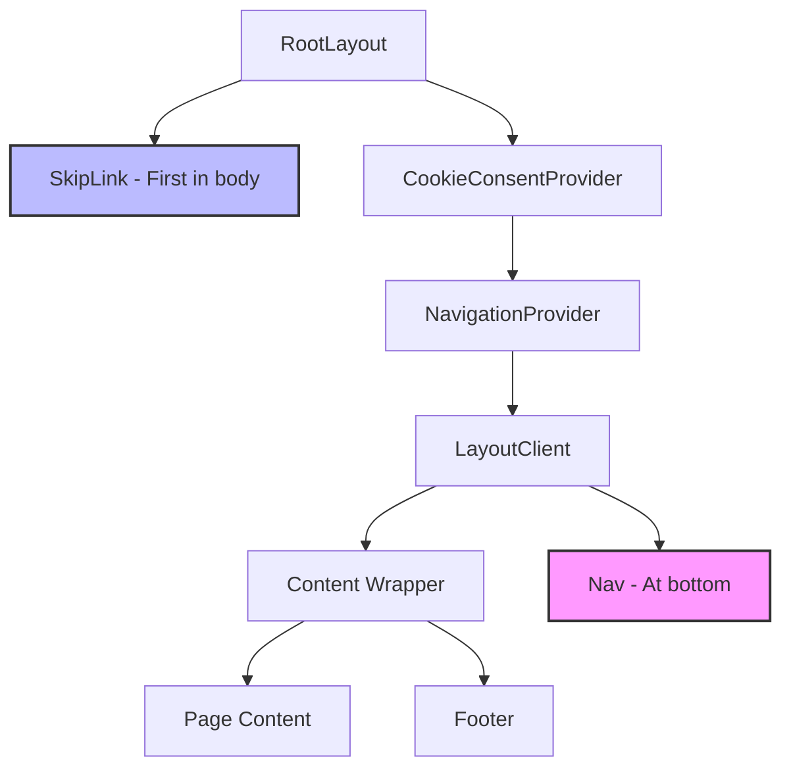
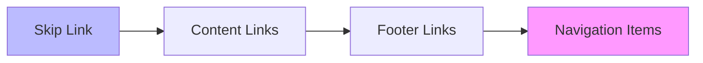
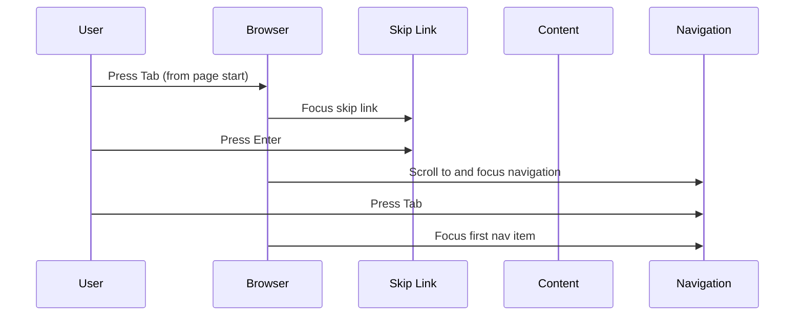
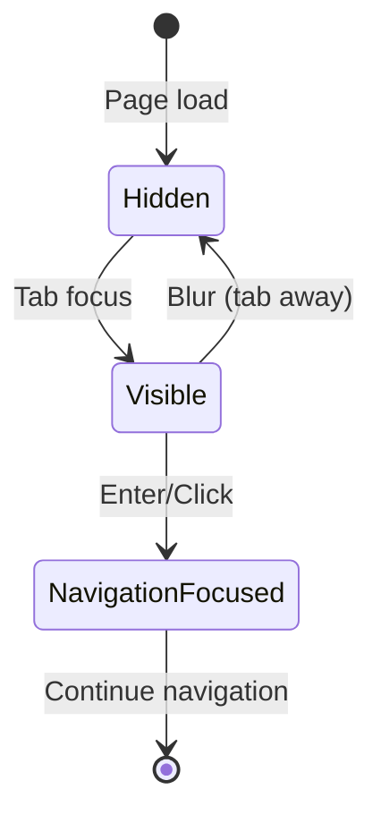

# Design Document: Skip Navigation Link for Keyboard Accessibility

## Overview

This document describes the technical design for improving keyboard navigation accessibility by implementing a skip navigation link. The skip link allows keyboard users to quickly jump to the main navigation at the bottom of the page, providing an optional shortcut while maintaining the natural tab order (content first, then navigation).

The implementation follows WCAG 2.1 Level AA guidelines and integrates seamlessly with the existing Next.js 16 application architecture, React 19 components, and punk rock aesthetic. The solution uses CSS positioning to hide the link by default and reveal it on focus, providing an elegant accessibility enhancement with minimal code.

## Architecture

### Component Structure

```
src/
├── components/
│   └── navigation/
│       ├── SkipLink.tsx          # New: Skip link component
│       ├── SkipLink.test.tsx     # New: Skip link tests
│       └── Nav.tsx                # Modified: Add id="main-navigation"
├── app/
│   └── layout.tsx                 # Modified: Add SkipLink as first element
└── lib/
    └── types.ts                   # No changes needed
```

### Key Architectural Decision

**Skip Link Approach**:
- Skip link is first element in body (first in tab order)
- Visually hidden by default (off-screen positioning)
- Becomes visible when focused (moves to top-left)
- Links to `#main-navigation` at bottom of page
- Optional - users can skip to navigation OR tab through content

**Tab Order**: Skip link → Content links → Footer → Navigation (at bottom)

This approach is better than DOM reordering because:
- Users have choice (skip to navigation OR access content first)
- Natural tab order (content before navigation)
- Keyboard users aren't forced through navigation before content
- Follows WCAG best practices for bypass blocks

### Integration Points

1. **RootLayout** (`src/app/layout.tsx`): Add SkipLink as first element in body
2. **SkipLink** (`src/components/navigation/SkipLink.tsx`): New component
3. **Navigation** (`src/components/navigation/Nav.tsx`): Already has `id="main-navigation"`

## Components and Interfaces

### SkipLink Component (New)

A visually hidden link that becomes visible on focus, allowing keyboard users to jump to navigation.

**Implementation**:
```typescript
"use client";

export default function SkipLink() {
  return (
    <a
      href="#main-navigation"
      className="
        absolute -left-[9999px] top-0
        focus-visible:left-4 focus-visible:top-4
        z-50 px-4 py-2 rounded
        bg-black text-white
        font-display text-lg
        border-2 border-white
        focus-visible:outline-none focus-visible:ring-2 focus-visible:ring-amber-400
        transition-all duration-200
        motion-reduce:transition-none
      "
    >
      Skip to navigation
    </a>
  );
}
```

**Key Features**:
- `absolute -left-[9999px]`: Positions off-screen (visually hidden)
- `focus-visible:left-4 focus-visible:top-4`: Appears at top-left when focused
- `z-50`: High z-index to appear above all content
- `font-display`: Uses Bebas Neue (punk aesthetic)
- `bg-black text-white border-2 border-white`: Punk styling
- `focus-visible:ring-2 focus-visible:ring-amber-400`: Visible focus indicator
- `motion-reduce:transition-none`: Respects reduced motion preferences

**Rationale**:
- Off-screen positioning is standard technique for visually hidden content
- `focus-visible` ensures it only appears for keyboard users (not mouse clicks)
- Punk aesthetic matches site design
- Smooth transitions enhance UX (but respect motion preferences)

### RootLayout Modification

Add SkipLink as first element in body (before CookieConsentProvider).

**Current Structure**:
```typescript
<body className="bg-black text-white">
  <CookieConsentProvider>
    <NavigationProvider>
      <LayoutClient>{children}</LayoutClient>
      <LayoutCookieComponents />
    </NavigationProvider>
  </CookieConsentProvider>
</body>
```

**New Structure**:
```typescript
<body className="bg-black text-white">
  <SkipLink />
  <CookieConsentProvider>
    <NavigationProvider>
      <LayoutClient>{children}</LayoutClient>
      <LayoutCookieComponents />
    </NavigationProvider>
  </CookieConsentProvider>
</body>
```

**Key Changes**:
- SkipLink added as first child of body
- SkipLink is outside providers (doesn't need context)
- SkipLink is first in tab order

**Rationale**:
- First element in body = first in tab order
- Outside providers = simpler, no unnecessary context
- Pure HTML/CSS solution (no JavaScript needed)

### Nav Component (No Changes Required)

The Nav component already has the necessary attributes:

```typescript
<nav
  id="main-navigation"  // Already present - skip link target
  tabIndex={-1}         // Already present - allows programmatic focus
  className="fixed bottom-0 ..." // Already uses fixed positioning
  role="navigation"
  aria-label="Main navigation"
>
```

**Why No Changes Needed**:
- `id="main-navigation"`: Skip link target already exists
- `tabIndex={-1}`: Allows programmatic focus without adding to tab order
- All existing functionality preserved

## Data Models

### Type Definitions

No new types or interfaces are required. The SkipLink component has no props.

```typescript
/**
 * SkipLink component (no props)
 */
export default function SkipLink(): JSX.Element;
```

## Correctness Properties

*A property is a characteristic or behavior that should hold true across all valid executions of a system—essentially, a formal statement about what the system should do. Properties serve as the bridge between human-readable specifications and machine-verifiable correctness guarantees.*

### Property 1: Skip link is first in tab order

*For any* page in the application, pressing Tab from the start of the page should focus the skip link (not content).

**Validates: Requirements 1.4, 5.1, 5.2**

### Property 2: Skip link is visually hidden by default

*For any* page render, the skip link should not be visible on screen until focused.

**Validates: Requirements 1.2, 3.1**

### Property 3: Skip link becomes visible when focused

*For any* keyboard focus event on the skip link, it should become visible at the top-left of the viewport.

**Validates: Requirements 1.3, 3.2, 3.5**

### Property 4: Skip link navigates to navigation

*For any* activation of the skip link (Enter or click), the page should scroll to and focus the navigation element.

**Validates: Requirements 4.1, 4.3, 4.4**

### Property 5: Tab order is logical

*For any* keyboard navigation sequence, focus should move: skip link → content → footer → navigation.

**Validates: Requirements 5.1, 5.3, 5.4**

### Property 6: No keyboard traps exist

*For any* keyboard navigation sequence, users should be able to tab forward and backward through all focusable elements without getting trapped.

**Validates: Requirements 4.5, 5.4**

### Property 7: Skip link respects reduced motion

*For any* user with reduced motion preferences, the skip link should not animate when appearing/disappearing.

**Validates: Requirements 2.5, 6.6**

### Property 8: Skip link has accessible styling

*For any* render of the skip link, it should have sufficient color contrast and visible focus indicator.

**Validates: Requirements 2.3, 6.2, 6.5**

## Error Handling

### Edge Cases

1. **JavaScript disabled**: Skip link still works as standard HTML anchor link
2. **CSS not loaded**: Skip link visible at top (still functional, just not hidden)
3. **Screen readers**: Skip link announced as first element; provides bypass option
4. **Mobile devices**: Touch users can still activate skip link if they encounter it

### Potential Issues

1. **Navigation not in viewport**: When skip link is activated, navigation might be off-screen
   - **Solution**: Browser's native anchor link behavior scrolls to target
   - **Enhancement**: Navigation has `tabIndex={-1}` for programmatic focus

2. **Skip link not visible enough**: Users might not notice it when focused
   - **Solution**: High contrast (white on black), visible border, amber focus ring
   - **Solution**: Positioned at top-left (predictable location)

## Testing Strategy

### Unit Tests (Jest + React Testing Library)

Unit tests will verify component structure and behavior:

1. **SkipLink component**:
   - Renders without errors
   - Has correct href (`#main-navigation`)
   - Has correct text ("Skip to navigation")
   - Has off-screen positioning classes by default
   - Has focus-visible positioning classes
   - Has punk aesthetic styling (Bebas Neue, black/white, border)
   - Has focus indicator (amber ring)
   - Has reduced motion class

2. **RootLayout integration**:
   - SkipLink is first element in body
   - SkipLink appears before CookieConsentProvider
   - Component renders without errors

3. **Nav component**:
   - Has `id="main-navigation"` attribute
   - Has `tabIndex={-1}` attribute

### Integration Tests (Jest + React Testing Library)

Integration tests will verify tab order and keyboard navigation:

1. **Tab order**:
   - First Tab focuses skip link (not content)
   - Second Tab focuses first content link
   - Tab order: skip link → content → footer → navigation

2. **Skip link activation**:
   - Clicking skip link scrolls to navigation
   - Pressing Enter on skip link scrolls to navigation
   - Navigation receives focus after activation

3. **Keyboard navigation flow**:
   - No keyboard traps exist
   - Shift+Tab backward navigation works
   - Focus indicators are visible

### End-to-End Tests (Playwright)

E2E tests will verify keyboard navigation across real pages:

1. **Cross-page tab order**:
   - Home page: First Tab focuses skip link
   - /music page: First Tab focuses skip link
   - /live-shows page: First Tab focuses skip link
   - /about page: First Tab focuses skip link
   - /privacy-policy page: First Tab focuses skip link

2. **Skip link visibility**:
   - Skip link not visible by default
   - Skip link visible when focused (at top-left)
   - Skip link has correct styling when visible

3. **Skip link functionality**:
   - Activating skip link scrolls to navigation
   - Navigation is focused after skip link activation
   - Complete keyboard flow works (skip → content → footer → nav)

### Property-Based Tests (fast-check)

Property-based tests will verify universal properties:

1. **Tab order consistency**: For any page, first Tab always focuses skip link
2. **Visual hiding consistency**: For any page, skip link always hidden until focused
3. **Navigation target consistency**: For any page, skip link always links to `#main-navigation`

### Test Configuration

- **Minimum iterations**: 100 per property test
- **Test tags**: Each property test references its design document property
- **Tag format**: `Feature: skip-navigation-link, Property {number}: {property_text}`

### Accessibility Testing

- **Automated**: Use jest-axe for automated WCAG compliance checks
- **Manual**: Keyboard navigation testing with real screen readers (NVDA, JAWS, VoiceOver)
- **Tab order**: Verify logical tab order in all browsers
- **Visual testing**: Verify skip link appears correctly when focused

## Implementation Notes

### Why Skip Link Instead of DOM Reordering

This design chooses skip link over DOM reordering for several reasons:

1. **User choice**: Users can skip to navigation OR access content first (not forced)
2. **Natural tab order**: Content before navigation matches visual order
3. **Better UX**: Keyboard users aren't forced through navigation before content
4. **WCAG best practice**: Skip links are standard technique for bypass blocks
5. **Flexibility**: Works for both "skip to content" and "skip to navigation" patterns

### CSS Positioning Technique

The skip link uses off-screen positioning:
- `absolute -left-[9999px]`: Moves element far off-screen (visually hidden)
- `focus-visible:left-4`: Moves to viewport when focused
- This is standard technique used by many accessible sites
- Better than `display: none` (which removes from accessibility tree)
- Better than `visibility: hidden` (which makes unfocusable)

### Focus-Visible vs Focus

The skip link uses `focus-visible` instead of `focus`:
- `focus-visible`: Only shows for keyboard focus (not mouse clicks)
- `focus`: Shows for both keyboard and mouse
- `focus-visible` provides better UX (no flash when clicking)

### Reduced Motion Support

The skip link respects user motion preferences:
- `transition-all duration-200`: Smooth animation by default
- `motion-reduce:transition-none`: Disables animation for users who prefer reduced motion
- Follows WCAG 2.3.3 (Animation from Interactions - Level AAA)

### Browser Compatibility

- **Absolute positioning**: Universally supported
- **focus-visible**: Supported in all modern browsers (polyfill available for older browsers)
- **Anchor links**: Universal HTML feature
- **No JavaScript required**: Pure HTML/CSS solution

### Performance Considerations

- **No new dependencies**: Uses existing Tailwind utilities
- **Minimal bundle size**: Single small component
- **No JavaScript**: No runtime performance impact
- **No layout shift**: Positioned absolutely (doesn't affect layout)

## Mermaid Diagrams

### Component Hierarchy



### Tab Order Flow



### Keyboard Navigation Flow



### Skip Link State Machine



## Accessibility Compliance Checklist

### WCAG 2.1 Level AA Requirements

- ✅ **2.4.1 Bypass Blocks (A)**: Skip link provides mechanism to bypass repeated content
- ✅ **2.1.1 Keyboard (A)**: Skip link is fully keyboard accessible
- ✅ **2.1.2 No Keyboard Trap (A)**: Users can tab through all elements without traps
- ✅ **2.4.3 Focus Order (A)**: Focus order is logical (skip link first, then content)
- ✅ **2.4.7 Focus Visible (AA)**: Skip link has visible focus indicator (amber ring)
- ✅ **1.4.3 Contrast (AA)**: White on black provides sufficient contrast
- ✅ **2.3.3 Animation from Interactions (AAA)**: Respects reduced motion preferences

### Best Practices

- ✅ Uses semantic HTML (anchor element)
- ✅ Has descriptive link text ("Skip to navigation")
- ✅ First element in tab order
- ✅ Visually hidden until focused
- ✅ Works without JavaScript
- ✅ Works with screen readers
- ✅ Consistent with site design (punk aesthetic)
- ✅ Respects user preferences (reduced motion)

## Future Enhancements

Potential improvements for future iterations:

1. **Skip to main content**: Add second skip link to jump to page content (skip navigation)
2. **Landmark navigation**: Add keyboard shortcuts to jump between ARIA landmarks
3. **Focus management utilities**: Create reusable hooks for complex focus scenarios
4. **Accessibility testing automation**: Expand automated WCAG compliance testing
5. **Screen reader announcements**: Add live regions for dynamic content updates

## References

- [WCAG 2.1 Understanding Bypass Blocks](https://www.w3.org/WAI/WCAG21/Understanding/bypass-blocks.html)
- [WebAIM: Skip Navigation Links](https://webaim.org/techniques/skipnav/)
- [MDN: :focus-visible](https://developer.mozilla.org/en-US/docs/Web/CSS/:focus-visible)
- [A11y Project: Skip Navigation](https://www.a11yproject.com/posts/skip-nav-links/)
- [WCAG 2.1 Understanding Focus Visible](https://www.w3.org/WAI/WCAG21/Understanding/focus-visible.html)
